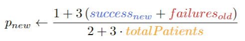

```{r setup, include=F}
# clear environment
rm(list=ls())

# setup options
knitr::opts_chunk$set(echo = FALSE, message = FALSE)
options(knitr.kable.NA = '-')
ndigits = 3
options(digits = ndigits)
labs = knitr::all_labels()
labs = labs[!labs %in% c("setup", "llm_appendix", "allcode")]
```

```{r load-libraries, include=F}

# load relevant packages
library(dplyr)      # data frame manipulation
library(ggplot2)    # plotting
library(gridExtra)  # grid of plots
```

1. Suppose we are comparing a new treatment to standard-of-care. We run a randomized clinical trial (with basic simple randomization), and would like to assess if treatment is more effective than control (using a binary outcome — response vs non-response). Suppose efficacy is assessed by the difference in response proportion between new-treatment and standard-of-care.

    Write a function that takes in data from a clinical trial run as above (a matrix with two columns: `tx` for treatment assignment, and outcome, with `outcome`=1 indicating response), and runs a permutation/re-randomization test to evaluate if the data are consistent with the hypothesis that standard-of-care is at least as effective as new-treatment.

```{r question-1-functions}

## ===============
## Question 1
## ===============
# helper function that takes in clinical trial data and runs a permutation test 
# to evaluate if the data is consistent with the hypothesis that standard-of-care 
# is at least effective as new treatment
calc_summary_stat <- function(data) {
  # split cases and controls
  data.cases = subset(data, tx==1)
  data.controls = subset(data, tx==0)
  # compute difference in proportion of successes among cases vs controls
  summary.stat = mean(data.cases$outcome) - mean(data.controls$outcome)
  return(summary.stat)
}

# helper function
permute_treatment <- function(data, 
                              adaptive=FALSE) {
  perm.data = data
  # adaptive randomization (this is used in Question 2)
  if (adaptive) {
    # perm.data = data %>% arrange(order)  # optional ordering
    s_new = 0
    f_old = 0
    totalP = 0
    for (i in perm.data$order) {
      currentP = perm.data[i,]  # row of current patient
      # compute probability of receiving new treatment
      p_new = (1+3*(s_new+f_old)) / (2+3*totalP)
      # assign current patient to treatment or control arm
      tx_new = rbinom(1, 1, p_new)
      currentP$tx = tx_new
      # update number of success among treated and failures among controls
      s_new = ifelse(currentP$tx & currentP$outcome, s_new+1, s_new)
      f_old = ifelse(!currentP$tx & !currentP$outcome, f_old+1, f_old)
      totalP = totalP+1   # increment number of assigned patients
      # insert updated patient data back into sample data
      perm.data[i,] = currentP
    }
  }
  # classical randomization (this is used in Question 1)
  else {
    perm.data$tx = sample(data$tx)  # re-randomize the outcomes of our sample
  }
  return(perm.data)
}

# helper function
sim_one_trial <- function(data, 
                          adaptive=FALSE) {
  # permute treatment within our sample
  perm.data = permute_treatment(data, adaptive)
  summary.stat = calc_summary_stat(perm.data) # return a summary statistic
  return(summary.stat)
}

# function
perm_test <- function(data, 
                      adaptive=FALSE) {
  # simulate a sampling distribution of the summary statistic using many 
  # permutations of the data
  n.permutations = 10000
  permutations = replicate(n.permutations, sim_one_trial(data, adaptive))
  return(list(output=permutations, n=n.permutations))
}

## helper function to visualize permutation output
plot_perm_test <- function(perm.test, 
                           observed.stat, 
                           plot=TRUE) {
  simulated.summary.stats = perm.test$output
  n.sims = perm.test$n
  simulated.quantiles = quantile(simulated.summary.stats, probs=c(0.05, 0.95))
  title = paste("Histogram of simulated differences in efficacy (", n.sims, 
                " simulations)", sep="")
  caption = "Blue indicates 5% and 95% quantiles\nRed indicates empirical 
            difference in efficacy"
  # visually compare our observed value to the simulated sampling distribution
  gg = ggplot() + 
    # visualize the simulated sampling distribution with its 5% and 95% quantiles
    geom_histogram(aes(simulated.summary.stats), bins = 100) + 
    geom_vline(xintercept=simulated.quantiles, linetype=2, col="blue") +
    # visualize our observed statistic
    geom_vline(xintercept=observed.stat, col="red") +
    labs(title=title, caption=caption) + 
    xlab("Difference in efficacy between treatment and control arms") + 
    ylab("Frequency") + 
    xlim(-1,1) +
    theme_bw()
  if (plot) {print(gg)}
  return(gg)
}
```

```{r question-1-example, fig.asp=0.5}

## conduct a permutation test of treatment efficacy using example data
# load example data
nsclc <- read.table("../data/nsclc-modified.txt")
test.data <- nsclc %>% select(tx=response,outcome=survival.past.400)

# compute our empirical summary statistic
summary.stat <- calc_summary_stat(test.data)
# simulate a sampling distributions of the summary statistic using permutations
set.seed(1)
perm.test <- perm_test(test.data)
simulated.summary.stats <- perm.test$output

# visually compare our observed value to the simulated sampling distribution
gg <- plot_perm_test(perm.test, summary.stat, plot=TRUE)
# compute proportions of simulation that are greater than our observation
pval <- mean(simulated.summary.stats > summary.stat)
```

The percentage of simulated summary statistics that are greater than our observed summary statistic is `r pval`.

2. Consider the following adaptive randomization scenario:
Suppose we have pre-clinical evidence that a new treatment is much more effective than standard-of-care. Given this, it may not be ethical to randomize a ton of patients to standard-of-care. However, preclinical evidence is not always to be believed. 

    We decide to run a trial in which patients are enrolled one-at-a-time (sequentially). Each time a patient is enrolled, they are randomized to new treatment/control and then outcome is observed (all before the next patient is enrolled). Furthermore, we change our randomization probabilities after each outcome is observed using the scheme in Figure 1-- where p~new~ is our randomization probability for the new-treatment arm; with success~new~ the number of successes on the new-treatment arm (up to that point in the trial); failures~old~ the number of failures on the control-arm; and `totalpatients` the total number of patients enrolled (up to that point in the trial). 
    
    As patients are enrolled, randomized, and outcomes are recorded, p~new~ will change. This adaptation strategy was proposed and discussed (in more generality) in Wei and Durham (1978). It is known as a randomized play the winner rule. At the end of the trial, we assess effectiveness of treatment by looking at the difference between proportion of successes on the new treatment, and successes on the control, calculated on all the patients from the trial.

{width=40%}

(a) Write a function that will take in data from a trial run as above (i.e., a matrix with one column `tx` of treatment assignments, one column `outcome` of binary outcomes, and one column order of enrollment order) and run a re-randomization test. The test should assess if the observed difference in response proportions is consistent with the hypothesis that standard-of-care is at least as effective as the new-treatment.

See function `permute_treatment()`, in the Code Appendix at the end of this report, which has a parameter that toggles adaptive and classic re-randomization of treatment.

```{r question-2a}

## ===============
## Question 2
## ===============

## see function `permute_treatment()`, which has a parameter that toggles adaptive
## or classic re-randomization of treatment
```

(b) Read in the data “HW2-adaptive-trial.txt” from the website; and, using your function from 2a, evaluate if the data are consistent with the hypothesis that standard-of-care is at least as effective as the new treatment.

```{r question-2b, fig.asp=0.5}

## conduct a permutation test of treatment efficacy using the example data
adptv <- read.delim("../data/HW2-adaptive-trial.txt", sep=",")
summary.stat <- calc_summary_stat(adptv)  # compute our empirical statistic
# simulate a sampling distributions of the statistic using permutations
set.seed(1)
perm.test <- perm_test(data=adptv, adaptive=TRUE)
simulated.summary.stats <- perm.test$output

# find the 5% and 95% quantiles of our simulated values
# simulated.quantiles <- quantile(perm.test$output, probs=c(0.05, 0.95))

# compute percentage of simulated summary statistics that are greater than our
# observed summary statistic
pval <- mean(simulated.summary.stats > summary.stat)
```

3. Now suppose a collaborator provided the data in “HW2-adaptive-trial.txt”, but forgot to say that they were generated using an adaptive trial. In this case we would likely accidentally analyze our data using the function written in (1). How does the sampling distribution of $\hat \pi$~new~ $- \hat \pi$~old~ generated from the simple permutations in (1) compare to the sampling distribution generated using our adaptive re-randomization from the function in (2a)?

```{r question-3, fig.asp=1}

## ===============
## Question 3
## ===============

# simulate a sampling distributions of the summary statistic using permutations
set.seed(1)
perm.test2 <- perm_test(data=adptv)  # "adaptive=FALSE" is a default argument 
pval2 <- mean(perm.test2$output > summary.stat)

# visually compare our observed value to the simulated sampling distribution
gg <- plot_perm_test(perm.test, summary.stat, plot=FALSE)
gg2 <- plot_perm_test(perm.test2, summary.stat, plot=FALSE)

gridExtra::grid.arrange(
  gg + labs(title="", caption="", subtitle="Classic re-randomization") +
    xlab("") + ylab(""),
  gg2 + labs(title="", subtitle="Adapative re-randomization") + 
    xlab("") + ylab(""),
  top=gg$labels$title, left=gg$labels$y, bottom=gg$labels$x)
```


**End of report. Code appendix begins on the next page.**

\pagebreak

## Code Appendix

```{r allcode, ref.label = knitr::all_labels(), echo=TRUE, eval=FALSE}
```

**End of document.**
